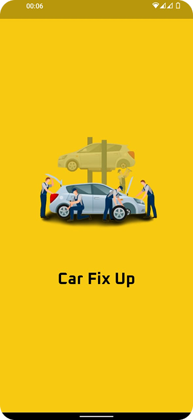
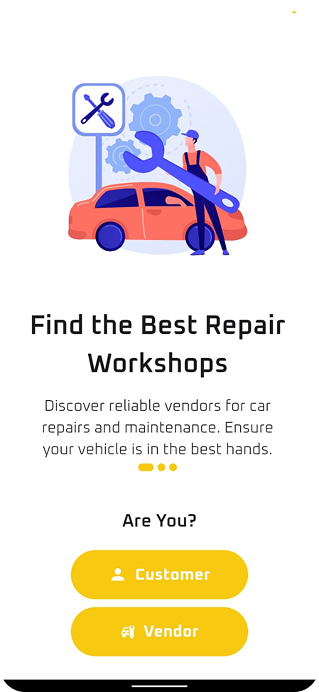
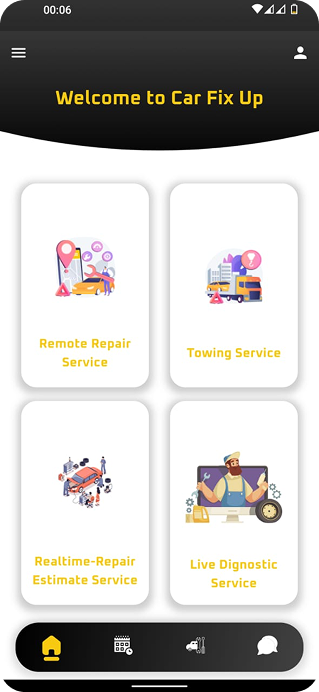
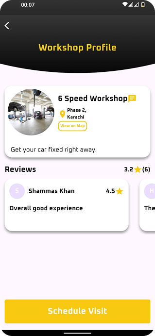

# 🚗 Car Fix Up

A full-featured **Flutter** mobile application integrated with **Firebase** and **GetX**, designed for both **Customers** and **Vendors** in the automobile service industry.

This app allows users to:
- Schedule repair appointments
- Request towing services with **live truck tracking**
- Make **emergency video calls**
- Receive **real-time repair estimates**

---

## 📱 Features

### ✅ Core Functionalities
- **Authentication** (Sign up / Login)
- **Onboarding screens** for first-time users
- **Dashboard** for quick access
- **Appointment scheduling** for customers and vendors
- **Live towing ride tracking**
- **Emergency video call integration**
- **Real-time repair estimates**
- **In-app chat** between customers and vendors
- **Vendor-side appointment management**

### 👥 Dual Role Support
- **Customer Panel**
  - Request towing
  - Schedule appointments
  - Chat with vendors
  - Receive estimates
- **Vendor Panel**
  - Manage appointments
  - Provide repair estimates
  - Communicate with customers

---

## 🔧 Tech Stack

| Tech       | Usage                           |
|------------|----------------------------------|
| Flutter    | UI and cross-platform app        |
| Firebase   | Auth, Firestore, Storage, etc.   |
| GetX       | State Management, Navigation     |

---

## 🖼 App Screenshots

All screenshots are stored under `assets/images/app_ss/`.

| Screen | Preview |
|--------|---------|
| Splash |  |
| Onboarding |  |
| Sign Up |  |
| Dashboard |  |
| Profile |  |
| Chat List |  |
| Chat |  |
| Schedule Appointment 1 | .png) |
| Schedule Appointment 2 | .png) |
| Repair Estimate - Select |  |
| Repair Estimate - Result |  |
| Towing Request |  |
| Towing Ride (Live Tracking) |  |
| Vendor Appointments |  |
| Will Pop Confirmation |  |

---

## 🚀 Getting Started

### Prerequisites

- Flutter SDK (>=3.x)
- Firebase project setup
- Android Studio / Xcode
- Internet connection

### Installation

1. **Clone the repo**
   ```bash
   git clone https://github.com/yourusername/car_fix_u
